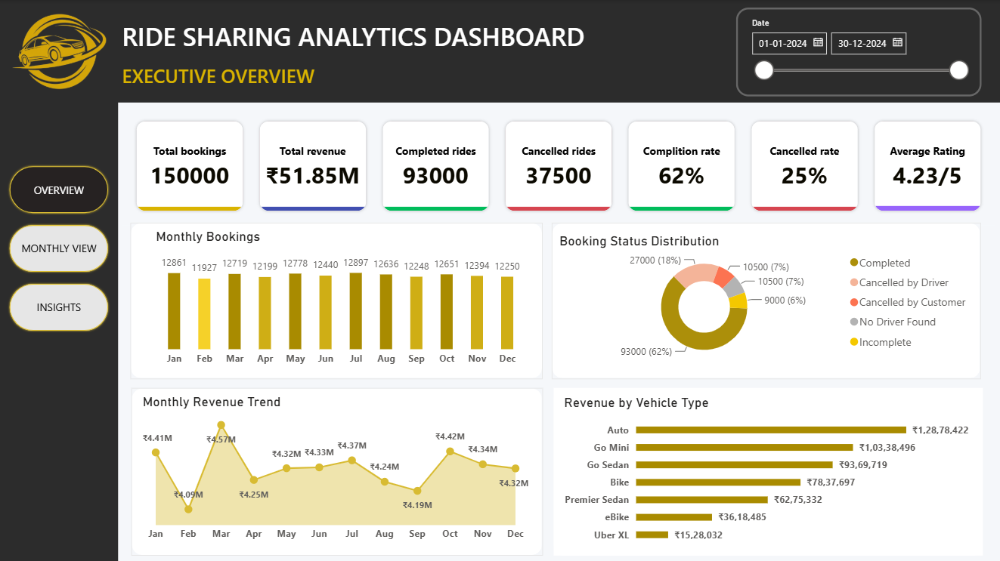
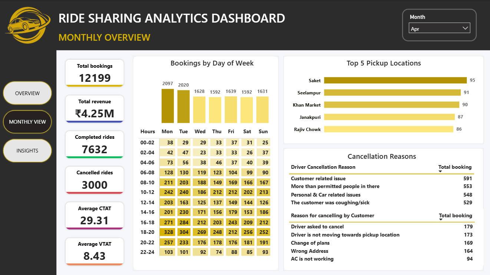
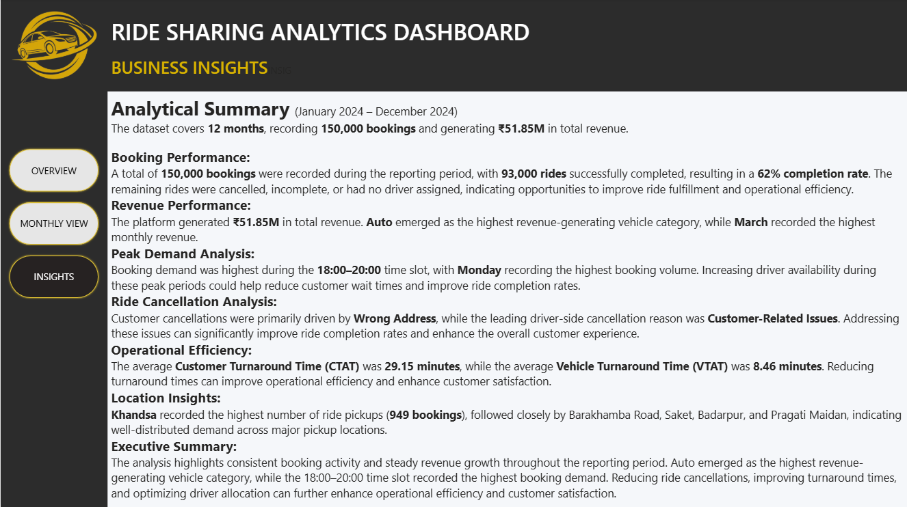

# Ride Sharing Analytics Dashboard

An interactive **Power BI dashboard** that analyzes ride-sharing booking data to uncover insights into booking trends, revenue, ride completion, cancellations, operational efficiency, and customer behavior.

---

##  Project Overview

This project provides a comprehensive analysis of ride-sharing operations through three interactive dashboard pages:

- **Executive Overview** – High-level business KPIs and overall performance.
- **Monthly Overview** – Month-wise operational analysis with weekly booking patterns, pickup locations, and cancellation reasons.
- **Business Insights** – Key findings and actionable insights derived from the data.

---

##  Dashboard Preview

### Executive Overview

---

### Monthly Overview

---

### Business Insights

---

##  Key Features

- Executive KPI Dashboard
- Interactive Date & Month Filters
- Monthly Booking Trend
- Monthly Revenue Trend
- Booking Status Distribution
- Revenue by Vehicle Type
- Weekly Booking Heatmap
- Top 5 Pickup Locations
- Ride Cancellation Analysis
- Customer Turnaround Time (CTAT)
- Vehicle Turnaround Time (VTAT)
- Driver Rating Analysis
- Business Insight Summary

---

##  Key Performance Indicators (KPIs)

- Total Bookings
- Total Revenue
- Completed Rides
- Cancelled Rides
- Completion Rate
- Cancellation Rate
- Average Driver Rating
- Average CTAT
- Average VTAT

---

##  Dashboard Pages

### 1️⃣ Executive Overview

Provides an overall snapshot of business performance, including:

- Total Bookings
- Total Revenue
- Completed & Cancelled Rides
- Completion & Cancellation Rates
- Driver Rating
- Monthly Booking Trend
- Monthly Revenue Trend
- Booking Status Distribution
- Revenue by Vehicle Type

---

### 2️⃣ Monthly Overview

Enables month-wise operational analysis using an interactive month slicer.

Includes:

- Monthly KPIs
- Bookings by Day of Week
- Weekly Booking Heatmap
- Top 5 Pickup Locations
- Customer & Driver Cancellation Reasons
- Average CTAT
- Average VTAT

---

### 3️⃣ Business Insights

Summarizes the most important business findings, including:

- Booking Performance
- Revenue Performance
- Peak Demand Analysis
- Ride Cancellation Analysis
- Operational Efficiency
- Location Insights
- Executive Summary

---

##  Tools & Technologies

- Power BI Desktop
- Power Query
- DAX
- Data Modeling

---

##  Skills Demonstrated

- Data Cleaning
- Data Transformation
- Data Modeling
- DAX Measures
- Power Query
- Interactive Dashboard Design
- Data Visualization
- Business Intelligence
- Business Insight Generation

---

## 🎯 Business Insights

- Completed rides accounted for **62%** of all bookings.
- Auto generated the highest revenue among all vehicle categories.
- Booking demand peaked during the **18:00–20:00** time slot.
- Wrong Address was the leading customer cancellation reason.
- Customer Related Issues were the leading driver cancellation reason.
- Khandsa recorded the highest pickup volume among all locations.

---

## 👨‍💻 Author

**Abhijith P Anil**

If you found this project helpful, feel free to ⭐ the repository.
